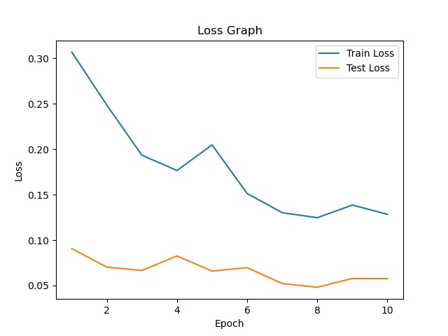
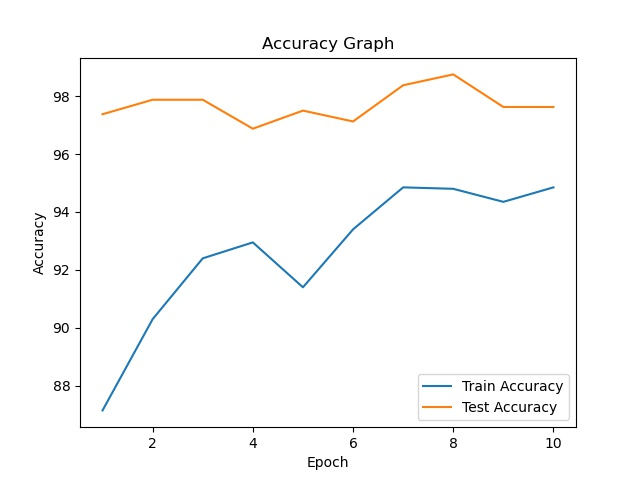
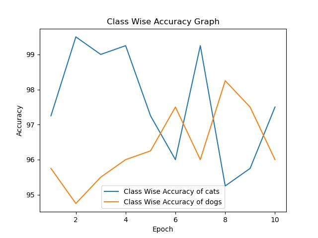

<h1 align='center'>Training Summary</h1>

## Data
|    | Description          | value      |
|---:|:---------------------|:-----------|
|  0 | Total Train Data Set | 2000       |
|  1 | Total Test Data Set  | 800        |
|  2 | Total Classes        | 2          |
|  3 | Class Names          | cats, dogs |
## Model
|    | Description   | value                                 |
|---:|:--------------|:--------------------------------------|
|  0 | Model         | Resnet 18(Pretrained)                 |
|  1 | Optimiser     | SGD                                   |
|  2 | Loss function | Cross Entropy(lr=0.001, momentum=0.9) |
|  3 | Class Names   | cats, dogs                            |
## Training
|    |   epoch |   train_accuracy |   train_loss |   test_accuracy |   test_loss |   cats |   dogs |
|---:|--------:|-----------------:|-------------:|----------------:|------------:|-------:|-------:|
|  0 |       1 |            87.15 |     0.306915 |          97.375 |   0.0906639 |  99.5  |  95.25 |
|  1 |       2 |            90.3  |     0.248476 |          97.875 |   0.0702674 |  99.5  |  96.25 |
|  2 |       3 |            92.4  |     0.193455 |          97.875 |   0.0666303 |  98    |  97.75 |
|  3 |       4 |            92.95 |     0.176566 |          96.875 |   0.082559  |  99.25 |  94.5  |
|  4 |       5 |            91.4  |     0.204819 |          97.5   |   0.0659115 |  98.75 |  96.25 |
|  5 |       6 |            93.4  |     0.151302 |          97.125 |   0.0697077 |  96    |  98.25 |
|  6 |       7 |            94.85 |     0.130173 |          98.375 |   0.0522584 |  98.75 |  98    |
|  7 |       8 |            94.8  |     0.124672 |          98.75  |   0.0481039 |  99    |  98.5  |
|  8 |       9 |            94.35 |     0.138588 |          97.625 |   0.0577569 |  98.25 |  97    |
|  9 |      10 |            94.85 |     0.12836  |          97.625 |   0.0576163 |  98    |  97.25 |
## Graphs

